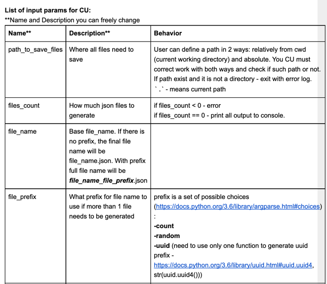

Capstone Project
----

Description
--
You will create a console utility for generating test data based on the provided data schema.

Project description:
--
Imagine that you have a data pipeline and you need some test data to check correctness of data transformations and validations on this data pipeline.

You need to generate different input data.

In our Capstone project we will solve it by creating a universal console utility that will generate our data for us. Format - only JSON.

Create all descriptions, names for commands, etc by yourself.

You need to implement (⚠️ please learn new materials with following links):
--

1. Name, description, help. Console Utility (CU) must have a name. You need to set a name on it and the name must be shown in “help”. Each command must have a help. Use argparse to get all those features from the box.
More about argparse:
https://docs.python.org/3/library/argparse.html

2. All params could be set up from cmd (command line). CU must take all params needed to generate data from the command line, but most of them must have default values.
3. Default values. All params for CU must have default values. All those values must be shown in CU help. All default values must be stored in the “default.ini” file and read from it with configparser. Names of options in default.ini must be identical to those options in console utility help.
More about configparser:
https://docs.python.org/3/library/configparser.html
4. Logging. All steps must have output in the console. If you’ve got some error, you must print it to the console with logging.error and only after that exit. If you start data generating - you need to write about it in the console, same if you finish. All logs must be printed in the console. If you want to, you can also duplicate all logs in a log file, but it is optional for this project.
More about logging:
https://docs.python.org/3/howto/logging.html#logging-basic-tutorial
5. Random data generation depends on field type and data schema. Described in detail in “Data Schema Parse” point.

**Parallelism.** Use multiprocessing to add the ability to speed up file generation.

Data Schema Parse:
--
Your script must parse data schema and generate data based on it.

All keys in data schema == keys in the final data event line.

**Example of data schema:**

{“date”:”timestamp:”, “name”: “str:rand”, “type”:”str:[‘client’, ‘partner’, ‘government’]”, “age”: “int:rand(1, 90)”}

**All values support special notation “type:what_to_generate”:**

“:” in value indicates that the left part of the value is a type.

**Type could be: timestamp, str and int.**

If in schema there is another type on the left part of the “:” statement in value, write an error.

For example, “str:rand” means that the value of this key must be a str type and it’s generated randomly.

**For right part of values with “:” notation, possible 5 options:**

1. **rand** - random generation, if on the left there is “str” type, for generation use uuid4 (need to use only one function to generate uuid prefix - https://docs.python.org/3.6/library/uuid.html#uuid.uuid4), str(uuid.uuid4())
If on the left there is “int” type, use random.randint(0, 10000)
2. **list with values []**. For example, ”str:[‘client’, ‘partner’, ‘government’]” or “int:[0, 9, 10, 4]”. Generator must take a random value from a list for each generated data line. Use random.choice.
3. **rand(from, to)** - random generation for int values in the prescribed range. Possible to use only with “int” type. If on the left part “str” or “timestamp”, write an error.
4. **Stand-alone value.** If in schema after “:” a value is written, which has a type corresponding with the left part, and the word “rand” is not reserved, use it on each line of generated data. For example, “name”: “str:cat”. So your script generates data where in each line attr “name”:”cat” will be. But if in schema there is “age”:”int:head”, it is an error and you must write about it in the console, because “head” could not be converted to int type.
5. **Empty value.** It’s normal for any type. If type “int” is with empty value, use None in value, if type “str”, use empty string - “”.

**For timestamp type** - ignore all values after “:”. If value exists in scheme, write logging.warning with a note that timestamp does not support any values and it will be ignored. Continue correct script work. Value for timestamp is always the current unix timestamp - enough to use time.time().

**List of input params for CU:**

Testing:
--
1. Write a parameterized test for different data types.
2. Write a parameterized test for different data schemas.
3. Write a test that uses temporary files to test your program when the data schema is loaded with a json file. You have to use fixtures here.
4. Test for the “clear_path” action.
5. Test to check saving file to the disk.
6. Write a test to check a number of created files if “multiprocessing” > 1.
7. Write your own test.

Acceptance Criterias:
--
1. All features are implemented and work.
2. All possible errors are processed and they have a logging and correct exit (impossible to create file, incorrect values, etc.).
3. Code must be divided into functions/classes/ logic blocks. It must not be a monolit sheet of code.
4. Unit tests exist.
5. All steps from the Project Checklist module are done.